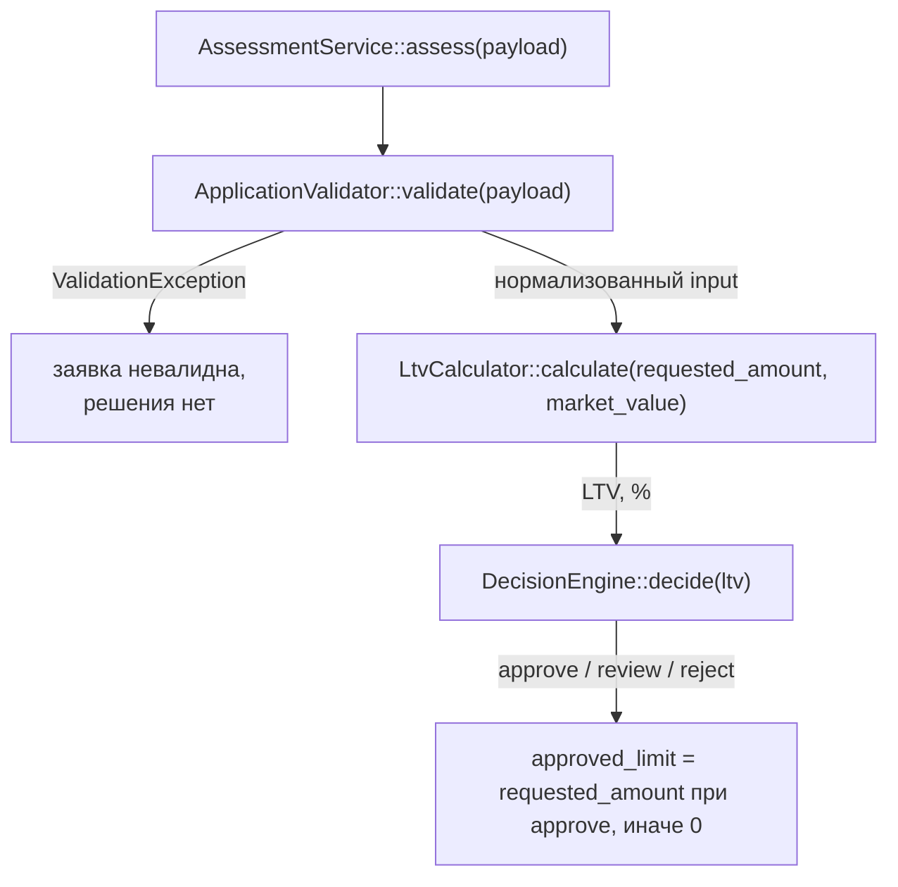

# Карта кода: как считается решение по заявке

Все пути — от корня репозитория. Ссылки на код в формате `файл:строка`.

## Участники

| Файл | Роль |
|---|---|
| `backend/config/rules.php` | Справочник бизнес-правил: пороги VIN, возраста, пробега, суммы, срока, LTV |
| `backend/src/Domain/ApplicationValidator.php` | Валидация и нормализация заявки |
| `backend/src/Domain/VinValidator.php` | Формальная проверка VIN |
| `backend/src/Domain/VehicleAge.php` | Возраст авто в полных годах |
| `backend/src/Domain/LtvCalculator.php` | Расчёт LTV |
| `backend/src/Domain/DecisionEngine.php` | Решение approve / review / reject по LTV |
| `backend/src/Domain/AssessmentService.php` | Оркестратор: валидация -> LTV -> решение -> лимит |
| `backend/src/Domain/ValidationException.php` | Исключение со списком ошибок валидации |
| `backend/src/AppFactory.php` | Сборка зависимостей, подключение `rules.php` (строка 27) |

## Порядок вызовов

Точка входа — `AssessmentService::assess(array $payload)` (`AssessmentService.php:28`).

### Шаг 1. Валидация — `ApplicationValidator::validate($payload)` (`ApplicationValidator.php:24`)

Нормализует и проверяет каждое поле по `rules.php`; при любой ошибке бросает
`ValidationException` (решение не вычисляется):

- `vin` → `VinValidator::isValid()`: длина 17 (`vin.length`), алфавит A-Z0-9,
  запрещённые символы I, O, Q (`vin.forbidden_chars`);
- `year` → `VehicleAge::inYears()` + `vehicle.min_year` (1990) и
  `vehicle.max_age_years` (20); возраст не может быть отрицательным (будущее);
- `mileage` → диапазон 0…`vehicle.max_mileage_km` (500 000);
- `market_value` → больше нуля;
- `requested_amount` → `amount.min`…`amount.max` (50 000…2 000 000);
- `term_months` → `term.min_months`…`term.max_months` (3…48).

Возвращает нормализованный массив `input`:
`{vin, year, mileage, market_value, requested_amount, term_months}`.

### Шаг 2. LTV — `LtvCalculator::calculate()` (`LtvCalculator.php:15`)

`round(requested_amount / market_value * 100, 2)` — проценты с двумя знаками.
`InvalidArgumentException` при неположительных аргументах недостижим: их уже
отсекла валидация.

### Шаг 3. Решение — `DecisionEngine::decide(float $ltv)` (`DecisionEngine.php:30`)

Пороги приходят в конструктор из `$rules['ltv']` (инъекция в `AppFactory.php:37`):
`approve_max` = 60.0, `review_max` = 85.0.

- `ltv < 60` → `approve` (`DecisionEngine::APPROVE`);
- `60 <= ltv <= 85` → `review` (`DecisionEngine::REVIEW`);
- `ltv > 85` → `reject` (`DecisionEngine::REJECT`).

Расхождение: комментарии в `rules.php:39-41` и `DecisionEngine.php:10-12`
описывают границу как `LTV <= approve_max -> approve`, а код использует строгое
`<` (`DecisionEngine.php:32`). LTV ровно 60.0 даёт `review`, а не `approve`.

### Шаг 4. Лимит — в `AssessmentService::assess()`

`approved_limit` = запрошенная сумма при `approve`, иначе 0.
Расчёт лимита по справочнику `rules.ltv_by_age` не реализован (задача LOAN-12:
справочник заполнен, кодом не используется).

## Куда встанет правило «пробег > 400 000 км -> review»

Правило меняет вердикт, а не валидность заявки, поэтому его место — в
`DecisionEngine::decide()`: после LTV-проверок, если LTV-решение `approve`,
но пробег превышает порог, понизить до `REVIEW`.

Уже есть:

- нормализованный `$input['mileage']` возвращается `validate()` и доступен в
  `AssessmentService::assess()` (но не внутри `DecisionEngine`);
- паттерн «порог из конфига» через конструктор (`DecisionEngine` уже получает
  `$rules['ltv']` тем же способом);
- константа `DecisionEngine::REVIEW`.

Не хватает:

- порога 400 000 в `rules.php` — есть только `vehicle.max_mileage_km = 500000`,
  но это валидационная граница («кривая заявка»), а не порог решения;
- передачи пробега в `DecisionEngine`: `decide(float $ltv)` про пробег не знает —
  нужно расширить сигнатуру (и вызов в `assess()`) или передать порог в
  конструктор, а пробег параметром метода;
- семантики на стыках: что делать при LTV-`review` (остаётся review) и особенно
  при LTV-`reject` — понижать до review или нет. Механизма для этого в коде нет,
  в формулировке правила это не сказано.

Альтернатива: проверка в `AssessmentService::assess()` после строки 33 —
перезаписать `$decision` по `$input['mileage']`. Работает без правки
`DecisionEngine`, но ломает текущее разделение ответственности (весь выбор
решения инкапсулирован в `DecisionEngine`).

## Что сейчас проверяется про пробег

Единственная проверка — `ApplicationValidator::validate()`
(`ApplicationValidator.php:43-46`): приведение к int (отсутствующее поле
превращается в -1) и отказ при `mileage < 0` или `> 500 000`. Ошибка попадает в
`ValidationException` с текстом «Пробег от 0 до 500000 км».

На LTV, решение или лимит пробег не влияет. За пределами Domain он только
сохраняется в БД (`ApplicationRepository.php:38-45`, колонка `mileage_km`) и
возвращается в списке полей. Иных порогов по пробегу, кроме 500 000, в
`rules.php` нет.
